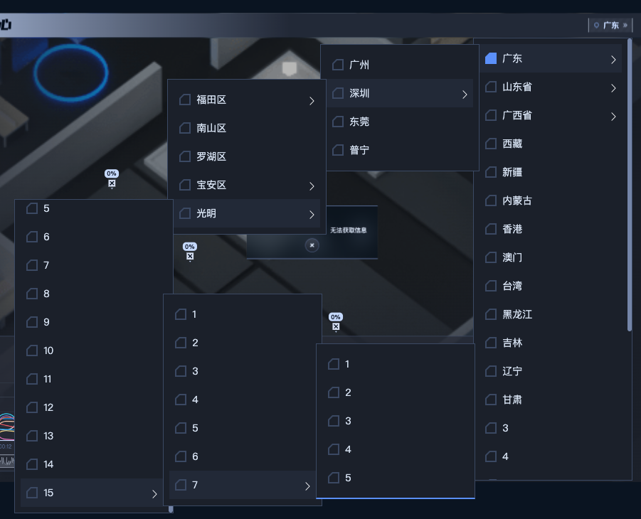

<div align="center"> <a href="https://github.com/corerain/float-collapse-menu">  </a> <br> <br>

[](LICENSE)

<h1>FloatCollapseMenu（悬浮折叠菜单）</h1>
</div>

**中文** | [English](./README.md)

## 简介

FloatCollapseMenu 是vue2.x组件，仿Chrome浏览器自动折叠下拉菜单。

## 特性

- **vue**：vue2.x组件

## 预览

https://corerain.github.io/float-collapse-menu/

<p align="center">
    
</p>

## 使用

## Vue.js 2.x

组件使用:

### 基础用法:
``` html
<float-collapse-menu
  v-model="modelValue"
  :list="list"
  scroll-el=".test-demo-page"
  :props="props" />
```
vue组件文件:
``` js
  import FloatCollapseMenu from 'FloatCollapseMenu'
  ...
  export default {
    components: {
      FloatCollapseMenu,
    },
    data() {
      return {
        list: [
          {
            "id": 1, 
            "name": "菜单1"
          }, 
          {
            "id": 2, 
            "name": "菜单2",
            children: [
              {
                "id": 3, 
                "name": "菜单2-1",
              }
            ]
          }
        ],
        props: {
          label: 'name',
          value: 'id',
          children: 'children'
        },
        modelValue: 1
    }
  }
  ...
```

## Props

|名称|说明|类似|是否必填|默认值|
|---|---|---|---|---|
|list|原始数据列表|`Array`|`true`|[]|
|props|listItem 每条数据对应的字段|`Object`|`false`|{"label":"label","value":"value","children":"children"}|
|value|双向绑定数据值|`String` /  `Number`|`true`|-|
|maxWidth|选中显示框最大长度|`Number`|`false`|304|
|minWidth|选中显示框最小长度|`Number`|`false`|180|
|popoverItemWidth|悬浮菜单item宽度|`Number`|`false`|224|
|borderWidth|边框宽度|`Number`|`false`|1.5|
|scrollEl|页面滚动元素|`String`|`false`|body|


## Events

|事件名称|说明|回调参数|
|---|---|---|
|change|双向绑定-选择节点|参数为当前节点 id|
|select|选中节点|参数为当前节点 node|


## License

Copyright (C) 2022 Corerain. All Rights Reserved.

Licensed under the Apache License, Version 2.0 (the "License");
you may not use this file except in compliance with the License.
You may obtain a copy of the License at

    http://www.apache.org/licenses/LICENSE-2.0

Unless required by applicable law or agreed to in writing, software
distributed under the License is distributed on an "AS IS" BASIS,
WITHOUT WARRANTIES OR CONDITIONS OF ANY KIND, either express or implied.
See the License for the specific language governing permissions and
limitations under the License.
